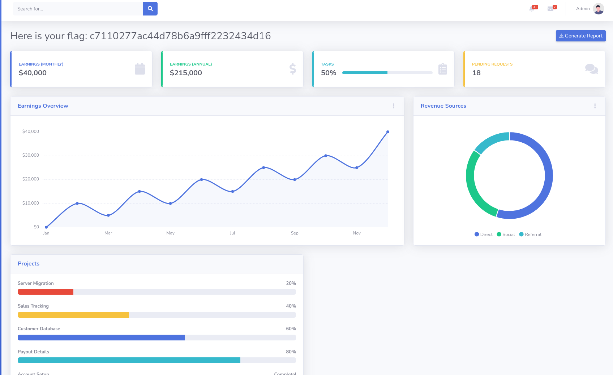

# [Machine Name] - HackTheBox Writeup

**Date:** 2026-03-29
**OS:** Linux
**IP Address:** 10.129.1.15
**Difficulty:** Very Easy
**Points:** 10

---

# 1. Executive Summary

This writeup documents the exploitation process for the HackTheBox machine **Crocodile**. 

*   **Initial Access:** Gained by using anonymous FTP access to retrieve a list of users and passwords, then identifying a hidden login page and using the credentials to access the admin dashboard.
*   **Privilege Escalation:** Not required for this "Starting Point" machine as the initial access provided the flag on the dashboard.
*   **Key Learning Points:** 
    * Enumerating anonymous FTP services.
    * Directory brute-forcing to find hidden web pages.
    * Managing and testing sets of credentials.

---

# 2. Reconnaissance & Enumeration

## 2.1. Nmap Scan

| Port | Service | Version | Notes |
| :--- | :--- | :--- | :--- |
| 21/tcp | FTP | vsftpd 3.0.3 | Anonymous access allowed |
| 80/tcp | HTTP | Apache httpd 2.4.41 | Ubuntu instance |

**Nmap Command:**
```bash
nmap -sC -sV -oN nmap/Crocodile -p 21,80 10.129.1.15
```

## 2.2. Web Enumeration
**Strategy:** Directory brute-forcing to find hidden administration or login pages.

### Directory Brute Forcing
```bash
gobuster dir -u http://10.129.1.15 -w /usr/share/wordlists/dirbuster/directory-list-2.3-small.txt -x php
```
Findings included `/login.php` and `/dashboard.php`.

---

# 3. Initial Access (User Flag)

## 3.1. Vulnerability Analysis
*   **Vulnerability:** Information Leakage via FTP & Insecure Web Login
*   **Vector:** FTP Anonymous Login (Port 21) & HTTP Login Page (Port 80)

## 3.2. Exploitation Path
Connecting to FTP anonymously allowed the retrieval of `allowed.userlist` and `allowed.userlist.passwd`. Using these lists, the `admin` user was found to be valid with the password `@BaASD&9032123sADS` on the `/login.php` page.

**Payload/Tool:**
```bash
ftp 10.129.1.15 # Use 'anonymous' for username
# Retrieve files: get allowed.userlist, get allowed.userlist.passwd
```

**User Flag:**
```text
c7110277ac44d78b6a9fff2232434d16
```

---

# 4. Privilege Escalation (Root Flag)

This machine is a single-level challenge; the flag was retrieved directly from the dashboard after logging in as an administrator.

---

# 5. Credentials & Loot

| Username | Password / Hash | Source |
| :--- | :--- | :--- |
| admin | @BaASD&9032123sADS | FTP Loot |

---

# 6. Recommendations & Mitigation
1. **Disable Anonymous FTP:** If not strictly required, disable anonymous logins to prevent information disclosure.
2. **Secure Login Interfaces:** Implement strong password policies and multi-factor authentication for administrative dashboards.
3. **Information Sanitization:** Ensure sensitive files like user lists or password lists are not stored in publicly accessible areas (like an anonymous FTP root).


