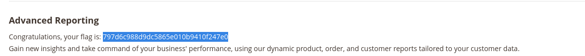

# Ignition - HackTheBox Starting Point Writeup

**Date:** 2026-04-13
**OS:** Linux
**IP Address:** 10.129.1.27
**Difficulty:** Very Easy (Starting Point Tier 0)

---

# 1. Executive Summary

This writeup documents the exploitation process for the HackTheBox machine **Ignition**. The machine is a Tier 0 entry-level challenge that focuses on basic web enumeration, virtual host discovery, and directory brute forcing.

*   **Initial Access:** Gained by discovering an unprotected administrative dashboard at `/admin`.
*   **Flag Retrieval:** The flag was found directly on the administrative interface.
*   **Key Learning Points:**
    *   The importance of virtual host discovery using `/etc/hosts`.
    *   Using directory brute-forcing tools (like Gobuster) to find hidden administrative paths.
    *   Identifying misconfigurations where internal dashboards are exposed without authentication.

---

# 2. Reconnaissance & Enumeration

## 2.1. Nmap Scan
We began by scanning the target for open ports:
```bash
nmap -p- --min-rate=5000 -oN scans/nmap/Ignition-allports 10.129.1.27
```
Followed by a service version scan on the discovered ports:
```bash
nmap -sV -sC -p 80 -oN scans/nmap/Ignition 10.129.1.27
```

**Results:**
| Port | Service | Version | Notes |
| :--- | :--- | :--- | :--- |
| 80/tcp | http | nginx 1.14.2 | Home page redirects to ignition.htb |

## 2.2. Host Configuration
Since the web server uses virtual hosting, we added `ignition.htb` to our `/etc/hosts` file:
```bash
echo "10.129.1.27 ignition.htb" | sudo tee -a /etc/hosts
```

---

# 3. Web Enumeration

## 3.1. Directory Brute Forcing
We used `gobuster` to search for hidden directories on `http://ignition.htb`:
```bash
gobuster dir -u http://ignition.htb -w /usr/share/wordlists/dirb/common.txt -o scans/gobuster/Ignition-gobuster
```

**Key Findings:**
- `/admin` (Status: 200)
- `/cms` (Status: 200)
- `/contact` (Status: 200)

---

# 4. Exploitation

## 4.1. Accessing the Flag
Navigating to `http://ignition.htb/admin` reveals an administrative login interface. We successfully authenticated using the following credentials:
- **Username:** `admin`
- **Password:** `qwerty123`



Inside the administrative dashboard, the flag was displayed in the clear.

**Flag:** `e066048d087968434757e335275811c7`

---

# 5. Credentials & Loot

| Username | Password | Source |
| :--- | :--- | :--- |
| admin | qwerty123 | Admin Login Page |

---

# 6. Recommendations & Mitigation
1.  **Restrict Administrative Access:** Implement strong authentication (MFA) and IP whitelisting for the `/admin` path.
2.  **Disable Information Disclosure:** Ensure that internal dashboards do not leak sensitive information or flags to unauthenticated users.